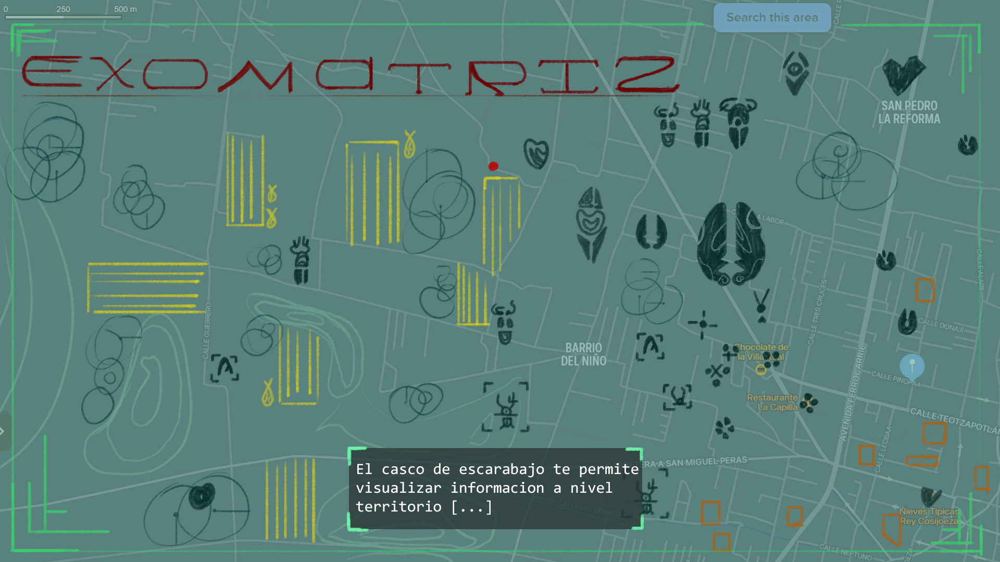

# exo-matriz

This is the repository for 'exo-matriz', a narrative/ fabulative simulation game made as a research-creation project that explores agro-ecological systems and the interaction of beetle populations with traditional agricultural practices in Mexico.

## Team:
- Fime de la Fuente
- Leonardo Morales Vega
## Art-research statement:

## Repo structure:

>**process:**
>This folder contains MDM documentation files -- 'journal', 'todo' & 'why' process tracking files.
>
>>**photos:**
>>This folder contains photos of physical notes and sketches.

> **reference:**
> This folder contains reference images and scientific papers that inform the design of exo-matriz.

> **unity-project:** (does not exist yet)
> This folder contains the Unity project files where material iteration happens

>**art-source:**
>This folder contains art creation source files.
