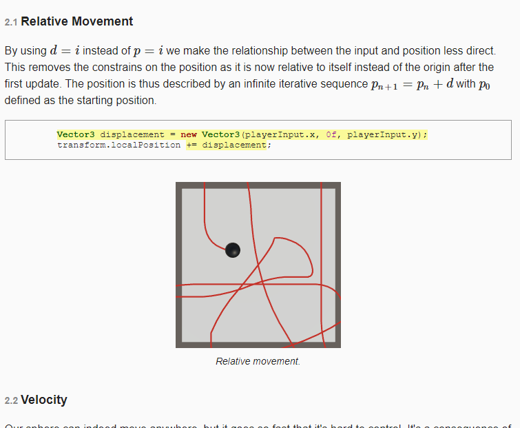
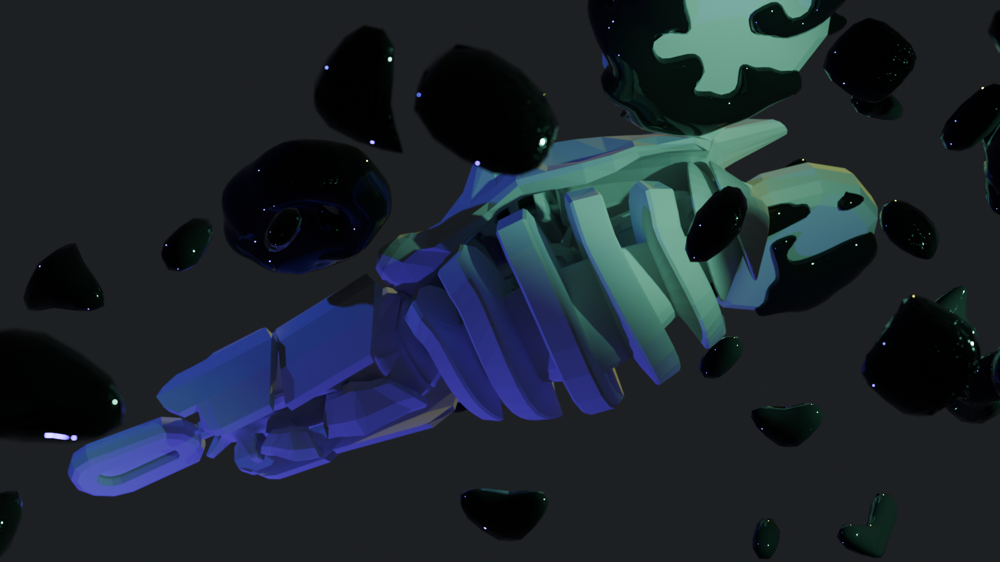
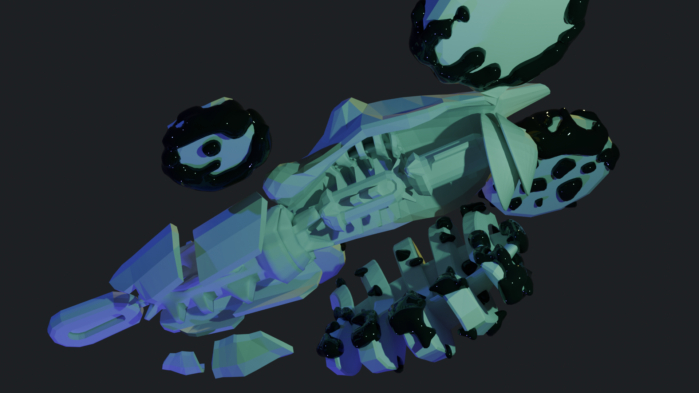
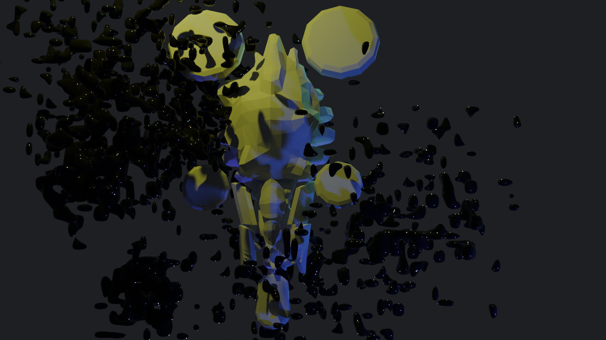
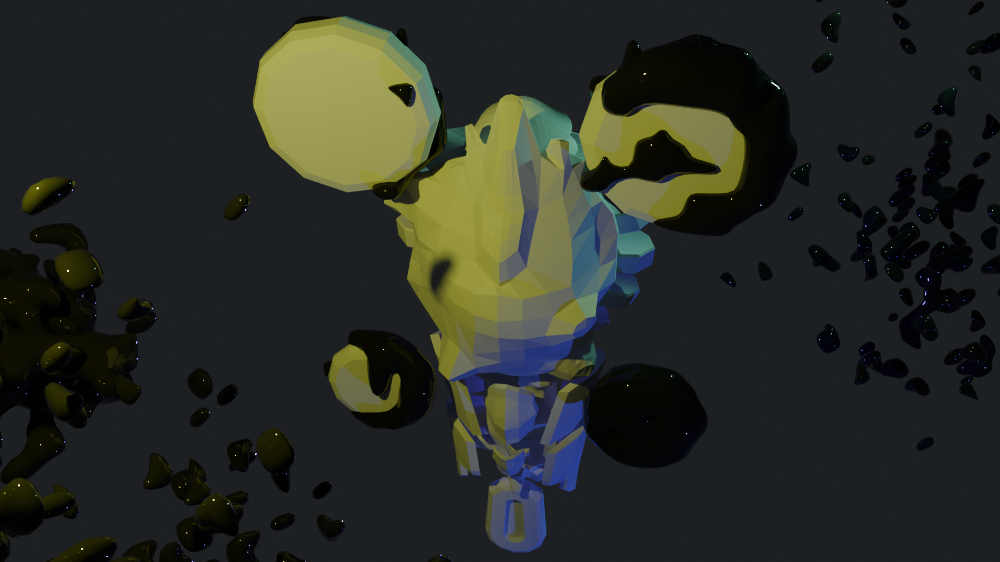
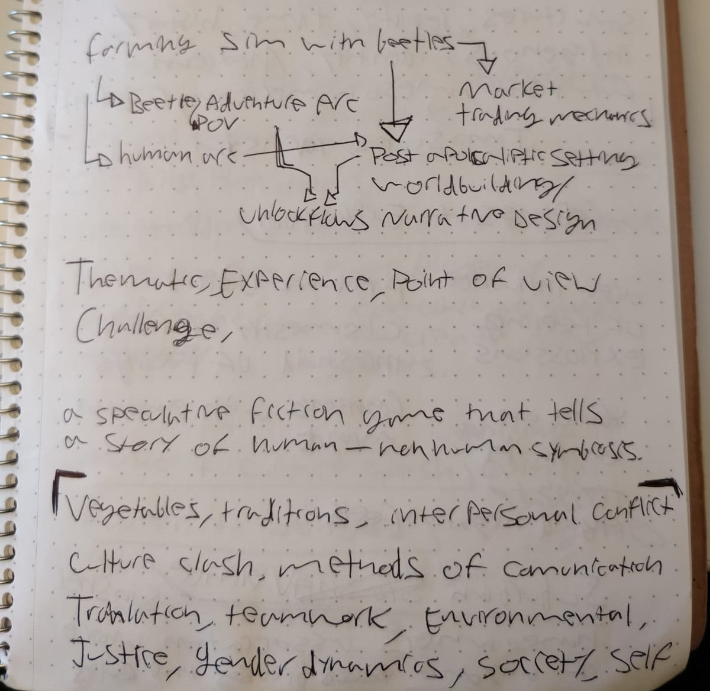
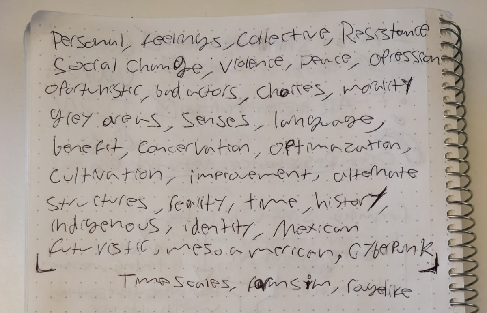

## 2024-04-17 | Character design sketching and post presentation reflection

sketched some beetles and gave a pitch presentation for class. I am mainly just having fun with the beetle design for it's own sake on one level, on another I am trying to observe physiological traits that might inform design, sometimes unintentionally. I fixated on the odd placement of the wings for example, and the hook-like spikiness of the legs. I was already thinking about a climbing mechanic, the wings make me think of a gliding, short spurts of flight mechanic. In general I am leaning to maximize chunk in the shape language.

Following the pitch presentation (I'll upload the slides to the design docs folder), I find that the game mode is a waaay disconnected from the main stream of the farming sim aspect of the game. The main areas of feedback focused on that fact, the clashing styles of 2D and 3D, and the fact that the beetle platformer could be it's own game. I was reminded of the need to ask intresting questions that can be answered by smaller iterative prototypes. And that It might be worth branching off from the larger project to follow the lines of inquiry brought by this path of exploration, namely around the goal of creating an atmospheric, abstract-narrative game that is not challenging to the player, and centers around contemplation and navigation of a 3D environment, the qualities of movement and camera perspective.

## 2024-04-17 | Level design concepting

I drew this diagram of what I envision a beetle traversal level to look like, and I annotated the drawing to convey how it fits within the larger game loop of exomatriz. 

At given points in space on the agro-ecosytem main game mode, the player will be able to trigger a transition to beetle traversal mode, where they are given control of a beetle character's movement. They explore the environment and attempt to reach the far end of the level, at which time they may transition onto a new level or back into agro-ecosytem mode.

The traversal is not meant to be particularly challenging, but rather satisfying or interesting, in terms of the qualities of the movement.  Different levels may offer more sluggish or more responsive controls, other's may feature different camera angles, or an orbiting perspective, or over-the-shoulder. One development goal is to implement a climbing mechanic as shown here: [Catlike Coding - Climbing](https://catlikecoding.com/unity/tutorials/movement/climbing/)

This game mode is also meant as an opportunity to explore the fabulative aspects of the narrative. Via text pop ups, dialogue boxy like things, revealing in abstract and poetic language the mystic undertones of the game's mythological, cyber-puny atmosphere. I imagine the tone ranging from the grandiose/ dramatic to the more mundane, funny, wholesome, slice-of-life of a beetle type of thing.

## 2024-04-16 | Movement variations

I spent some time playing around with the acceleration and max speed parameters, exploring the range of 'movement feel' that they give. With the fixed camera in a 3/4 perspective it really gives that feeling of closeness and smallness that I am after and the variations of movement quality show a lot of potential for design affordances. 

## 2024-03-24 | Visual style, narrative, and technical investigations

I decided to do a deep dive into movement controls and the details of their implementation by following this tutorial: [sliding a sphere](https://catlikecoding.com/unity/tutorials/movement/sliding-a-sphere/)

The implementation ignores the input system in Unity choosing to instead explain the underlying functions from the API and the core principles that go into player-controlled motion. I feel like I always need a refresher and some sort of structured method when it comes to fundamentals, and I  am finding it very satisfying to attain this level of control on systems that normally i might be wondering why they work. There's a whole series of movement tutorials on this site and I am excited to explore them, learn a whole bunch of stuff and adapt them to my needs.

On the narrative and visual style side of things I made some 3D explorations on Blender imagining a sort of divine coleoptera (beetle) that perhaps is a hybrid with a moth and a human. A sort of symbolic effigy of the divine being character that I imagined telling the story of the game.

To recap, or to explicitly tell it for the first time, I imagined a human that gains the ability to see from the perspective of beetles as a whole system, in conjunction with humans and their environment. And is now from that system's perspective witnessing the lives and historical events of his descendants, several generations into the future.

I want the beetle traversal game mode to be an opportunity to not only come into a micro scale of the system (kinnda like in the game Everything), but also for the game to become more abstract and to experience more intimately the backstory of this demi-god character, whose consciousness can move across time scales from a global POV.

I wrote this poem a while ago as a sort of game introduction:

What occludes the nocturnal view
but darkness unbound?
A place for indeterminate light.
I feel like I've been left to die.
Time on this scale is exhilarating,
the circuitry of the universe.
I never thought I'd be an ancestor to tomorrow.
My own perspective vastly insignificant.
I tested the limits of my influence,
far beyond, and from beyond my mortal heart's desires.
Now I am ancient. I am stone.
If it can be said that I take decisions,
it is only through you. All of you.
Precursors of dawn. 

## 2024-03-08 | Isolated feature prototyping, beetle movement and non-human POV

I've set out to prototype a number of movement explorations to develop the idea of a game mode that puts you in the point of view of a beetle traversing an environment.

I'm just gonna copy paste what I wrote on my Game Prototyping class repo here:  [CART315 class journal entry # 3](https://github.com/lmorv/CART315-GameProto/blob/main/process/journal.md#03---conceptualization--possible-tangents-in-exo-matriz-and-extra-ideation-to-appease-the-gods)

"I spent some time thinking of the different tangents I could take my existing project 'exo-matriz', and prototype in 'units' of distinct features. Some possible options are laied out in my notes that branch from the core concept of the game 'farming sim with beetles'. They are

- Market trading mechanics (the idea that you could trade the yield of your crops for money and upgrades).
- beetle adventure arc - (a beetle micro traversal of an environment from the POV of a beetle).
- Human arc societal arch (which I see as the main game mode).
- Post-apocalyptic worldbuilding / Narrative systems design. (building up the details of the world and a sort of chapter progression).

Unlock flows are sort-of central to many of these features too.

I also expanded out into wider concepts trying to generate new and completely different game concepts in class. my favorites are 'Orca Resistance Network', 'Feelings + Explosion' and 'Notebook + Cultivation'.

From now on I will continue my journaling and development in the exo-matriz repo moving forward with 3rd person movement explorations, a sort of platformer for beetle movement. My initial question is purely functional; How do I implement 3d movement in an interesting traversal mechanic context?"

## 2023-11-12 | Of debugging movement and parcel subdivision implementation

I've been struggling with the implementation of the subdivision algorithm and how to tackle the  systems from a practical programming perspective. My first approach to prototyping was to get familiar with the iterative workflow of coding with C# in Unity. I'd never done it in a design directed way like this before, and I really struggled to find the information that I needed (for my specific use case). I implemented some movement exercises (top-down WASD, and click-to-move) that I found as tutorials online. I adapted them minimally to fit the 2d environment. With the click-to-move I encountered some difficulty related to defining an offset and a rotation angle relative to the 'up' axis which in a 3d project is y and in a 2d project is z. It too some careful examination on two separate occasions to find the discrepancy. I knew it had to do with the differences in axis orientation, but for some reason I thought the ray-casting function was the source of the issue (which looks for a hit on the ground layer of the map when the user clicks on it to determine the displacement target position for the character).
The second time I took a look at it I had Sascha looking at the code with me. That's when we noticed the y axis being used explicitly with an implicit assumption of 'up' orientation. Even Sascha was surprised that just changing that to z fixed the issue immediately.
Also in the same session we got to addressing the issues with the parcel subdivision script that I initially generated using chatGPT and tried modifying to the best of my understanding. We basically started from scratch. And I just watched and tried periodically to be helpful by offering comments and giving space in turn as Sascha worked. 
## 2023-10-03 | Game design and cross-discipline communication

I've had some time to review the main paper describing the Zaachila model and the research methodology employed, and I've had a chance to talk to Fime about next steps in our design process. Originally he was going to provide an outline of a simplified variables system that would be the basis of the gamified interaction with the simulation. I imagined that that along with the narrative design would make up the loop after some iteration.

I have been thinking of a chapter-based approach to the narrative progression. Each chapter associated to a narrative objective that teaches the player something about the dynamics between the components of the agroecosystem matrix, tutorialize the game mechanics via narrative objectives and ramp-up the complexity from chapter to chapter. While also allowing the story to progress on an interpersonal-cultural level.

I figured that terrain types or 'patches' and the beetle and human agent would be the primary game objects, and I started to think of ways to implement behavior on them from an object-oriented approach. for example; I though that forest patches could be represented by intersecting circles with a radius property that increase or decreases according to proximity to a water source, they could be spawned on grass patches a and elevated terrain patches with enough surface area to host at least one tree (a circle with a radius). Agricultural patches may be more complicated objects, having a set of game action that the player can perform on then, such as 'irrigate', 'harvest', 'plant' and so on. They may also be converted to industrial agricultural patches via 'upgrades' essentially unlocking different game actions on them and giving up others --like the ability to plant more that one type of crop on them.

Grassland patches could also be subdivided dynamically according to programmed rules using something like a voronoi fractal function to slice them up with roads or into cells that represent urban development.

That's all starting to sound very complicated, and we'll need to tackle one problem at a time in practice. We'll need to figure out what gives us the most 'bang for our buck' to get our message across. Maybe that's just an agricultural patch that can turn in to a more efficient mono-crop patch and its interaction with grass, forest and urban patches, and a particle system of beetles that migrates between patches and dwindles or thrives according to game-state conditions.

Anyway, what came out of our last design planning chat is that we will end up having to design the simulation sort of from the ground up, informed by the input from the ecologists that where present on-site during the survey of the Zaachila matrix. Rather than base it off the computational model from the paper. That is for didactic considerations and also for representational considerations. I tried to synthesize my understanding of our problem-space to my friend Sascha in the following way: 

Sascha:
>Beetles? 

Leo:
>Yeeees!
>I got debriefed about the definition of a bunch of stuff. Like what 'matrices' are in the context of agroecosystems
>And they are having a discussion about how the computer model that is layed out in the paper is not very didactic, and also not very representative of the specific interactions that where observed in the area of study...
>The beetle behavior for example is not based on an actual species of beetle that is present in the town. It's based on one that is well studied and there's readily available data for 
>So the model serves as a kind of generalized proof of concept rather than an actual predictive tool...
>They wanna do a workshop with the peeps that actually observed the agroecosystems of the area to design something that they'd actually want to disseminate rather than base the design on something that doesn't quite show the real state of stuff
>And they want me to sort of give them a 'game design 101' debrief to orient the process.
>But essentially, me and fime will design a base system of variables and interactions on game objects, a game loop, and then adjust based on the outcomes of the workshop...
>Which will happen in about two weeks.
>So I gotta teach fime how to game design as I make the preliminary design docs. Then me and fime have to teach the rest of the ecologists how to game design together so that we can properly represent the dynamics of the matrix 

Sascha:
>Brooo sounds fucking dope - and insane. Let me know if you need a hand or have any technical questions. Also look up Unity for Humanity - and let me know if you have questions. We do some work with them.
 Fime is your friend / the connection right?

Leo:
> Yeah, Fime is my friend/collaborator. 
 It is pretty insane haha
 I'll look that up!

Sascha:
> I wonder if they have beetle specimens you could scan 
 👀👀

Leo:
>Oooo
 That would be dope

## 2023-09-23 | Can't say no to Coleoptera

Near the beginning of this fall semester, a friend, Fime de la Fuente contacted me with an idea for a serious game, based on some research he'd been working on with other people (paper included in the references folder in this repo). This was our conversation on Instagram: 

>Fime: 
>Hola Leo! ¿como estas?
>Oyes, yo sé que tu literalmente de dedicas a hacer juegos.
>Estoy haciendo una pasantía de investigación con una investigadora y se desarrolló un modelo de agentes (con reglas muy básicas) para unos coleopteros en una matriz agroecológica.
>Ahora queremos hacerlo un juego serio como para divulgación, pero ando mega perdido en tema como pasarlo a ser un juego.
>¿Tienes oportunidad de echarle una platicada, rolarme tips y obvio (si quieres) puedes ser parte de la construcción del juego y obviamente tendría tu autoría?
>puede ser también una ayudada nomás de una manera fácil tanto de pensar en el juego como de diseñarlo

>Leo: 
>Wow!
>Eso suena increible. Tengo muchas preguntas haha
>Son escarabajos no?
>me encantan los escarabajos
>Me encantaria saber mas hacerca del comportamiento de los agentes (como que tipo de movimiento pueden hacer, en que estados pueden estar, ) y supongo que la matriz se refiere como al efecto que tienen en su medio ambiente (?), como estas pensado en la representacion grafica de ese efecto?
>Y el estylo visual puede ser importante, como si te lo imaginas en 3d o 2d. lAs mates graficas van a ser diferentes e influiria un buen en las heramientas que escojes para construir la simulacion :p
>puedes utilizar un motor grafico como Unity o Unreal, o algo mucho mas basico como P5js en el browser.

> Fime: 
>que genial que te llame la atención :3 jejeje
>mira: te va todo el debraye
>(audio trascript)
>Que chido que te lata. Pues mira te voy a contar la historia; la historia es que en Oaxaca, en los valles centrales hay un lugar que se llama Zaachila. Es como un municipio. Este municipio tiene diferente 'calidad en la matriz', ahorita te digo que es 'calidad en la matriz' dependiendo de las practicas de agricultura llevadas a cabo, no? Cuando digo calidad en la matriz, ósea en biología como que se estudio --bueno no en biología; en ecología-- este que la conservación no es que importe tanto que un lugar este super conservado, sino que importa como que una meta población pueda como existir por todo el terreno como sin importar que este super conservado, no? Eso es una manera fácil de decirlo, por ejemplo como, pues no se, como las milpas no? son un habitat super importante para algunas especies de aves que las usan como pues pues de de ecosistema no? entonces se llevo a cabo como este concepto de agroecosistema. Y habemos personas que hacemos agroecología que pensamos que pues la agricultura tradicional es una manera muy chida de, pues de conservar tradiciones, cultura... pero también diversidad biológica no? esa es como la base de todo.
>Entonces partiendo de ese punto, ehhm, hicimos esta, este modelo de agentes en el cual como que, pues se estudio que los coleópteros --los curculiónidos-- que son escarabajos, como gorgojos as de cuenta son un super buen indicador porque están en la agricultura tradicional y casi nunca están en agricultura industrial no? osea son como un buen indicador. Y entonces una compa hiso un modelo, y modeló pues como alrededor de unas cuantas variables y como cambios de usos de suelo, este, que tan bueno es el parche --el parche es como el lugar-- como se va moviendo; si crese, si se reproduce, si sobrevive, si muere y asi. Y entonces es como una manera de entender como se comportan estas poblaciónes, como en torno a toda esta complejidad ecológica. 
>Si esta siendo como un poquito complicado, o al revez no si esta siendo muy baboso me avisas. Pero es que, eso, quiero comunicártelo chido. Ehhhm, y bueno total, pues lo que teníamos pensado era como usar este modelo --ósea traducirlo como a un jueguito. Y hacer un un este pues un juego, un juego serio como para divulgar, este, para que la gente lo juegue y aprenda no? como, pues como de estas interacciones, de como funcionan y así. De lo de el diseño, la verdad es que pues no tiene que ser un diseño super complejo. Yo creo que 2d esta super bien y así no? Y ósea 
>(end of audio transcript)

>Leo 
>Wowowo! Suena muy chido, y con muchas oportunidades en el diseño de interacciones. 
>Me imagino que el objeto de juego principal sería este 'parche' y como sus atributos y propiedades evolucionan en función a las variables con las que el jugador puede intervenir.
>Cuanto tiempo tienen para entregar el proyecto?

>Fime:
>si! justo como el municipio jaja, o puede ser nomás un parchecito
>pues en realidad creo que me latería ya entregarlo (el juego) ya acabado maximo febrero
>tener un draft para fin de mes, o algo así
>mira, mas o menos así se ve el modelo
>![[modelo.png]]
>mira, para que te des una idea
>...
>jajajaja

>Leo:
>whoa lol

>Fime:
>si….
>jajajajaja
>que terror
>pero nada, si quieres mañana te mando un mail con ideas/las reglas principales del modelo

>Leo:
>sas :))

>Fime:
>:^)

>Leo:
>tambien: La timeline del projecto suena factible, pero si creo que me voy a sentir super saturado si me comprometo a entrarle de lleno al 100% del desarrollo. Estoy justo empezando classes y tengo un projecto de investigacion (otro juego jaja) que estoy intentando terminar este semestre.

>Fime:
>Si obvio! Tu tranqui :)))

>Leo:
>Pero si me gusta mucho la idea y me encantaría darle a la conceptualización y lo que pueda <3

>Fime:
>Cualquier tip es super bien recibido! Y topo la saturación jajaja
>Y obvio siempre serás mencionado :^)
>Eso lo digo pa que lo sepas
>Y no tengas dudas jajaja

>Leo:
>Tambien siento que esta super alineado con otros objetivos de mi practica y de comunidad creativa y asi <3

>Fime:
>ggggenial

A couple of days later:

>Leo:
>Fime! Eh estado pensando un buen en el juego. Y me me vienen a la mente 2 juegps que tienen estilos similares y masomenos están el la misma area temática de lo que estamos intentando hacer:

>In Other Waters: https://store.steampowered.com/app/890720/In_Other_Waters/
>Life on the edge: https://store.steampowered.com/app/1968040/Life_on_the_Edge/

>Me imagino el gameplay un poco mas como un city-builder/ resource-management. Pero me gusta la idea de un punto de vista completamente top-down y un estilo visual como typo UI
>Creo que necesito un mas contexto de los métodos de investigación y teoría detrás de la practica. De los modelos de agentes y evaluación de matrices agro-ecologicas. Y especificamente como los agentes y las variables interactuan ebtre si.
>Me encantaria leer algunos papeles academicos y tratar de enter otros estudios similares, o cualquier cose que tengas en modelo actual.
>Y tambien queria preguntarte si puedo utilizar este proyecto para una clase de creación de investigación, y potencialmente como un caso de estudio para otra investigacion de metodos de documentacion del proceso creativo. Obvio creditos para todas las personas involucradas <3

>Fime:
>holisss leo
>me pasas tu whats o algo?
>jeje, siempre en instagram veo poco los mensajes
>y esto lo platicamos! yo creo que totalmente si (reply to "Y tambien queria preguntarte si puedo utilizar este proyecto para una clase de creación de investigación, y potencialmente...")
>pero woa charlarlo
>si quieres mándame un whatsapp/telegram y lo platicamos todo

And later on WhatsApp:

>Fime:
>oye, voy a hablar con Mariana, yo creo que es altamente probable que si se arme la colaboracion :))

The conversation continued with some logistics to meet on zoom later on and some major troubleshooting to view the model on a data visualization software called NetLogo. The model turned out to be way to large and computationally expensive to be navigable, but at least I got to look at the variables in context and get an idea of how it works on a very superficial level.

During the time of these conversations taking place and our zoom meeting my main narrative design insight was the idea of having two separate modes for interfacing with the game and the simulation: a human and a beetle mode. More on what that means design-wise later. And Fime and I agreed that the cultural/human aspect of the data should be a central focus of the experience.
I think the variable system design and the interaction design on top of that are gonna be the crux of iteration throughout the project. And I am really exited to see what it becomes!!

