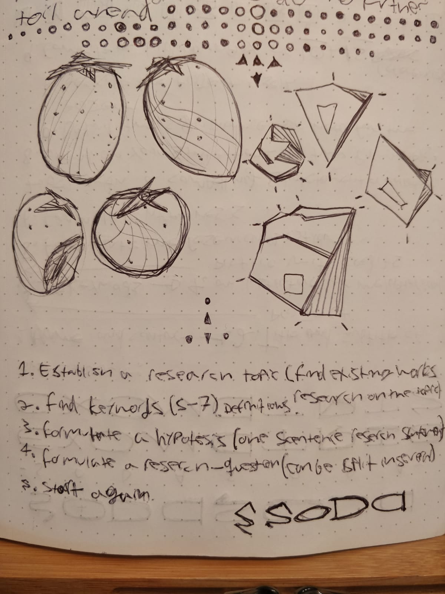
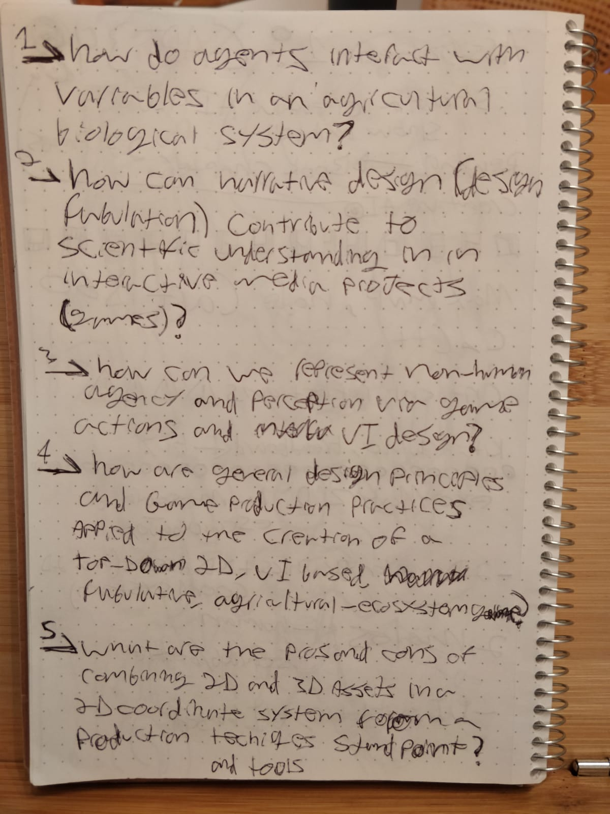
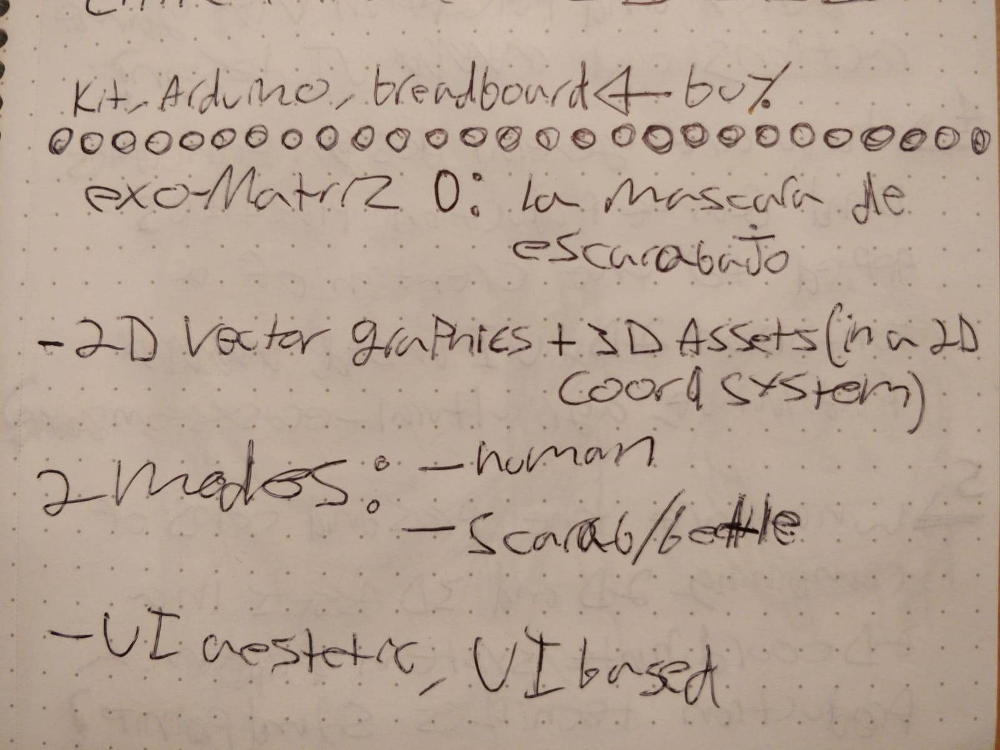
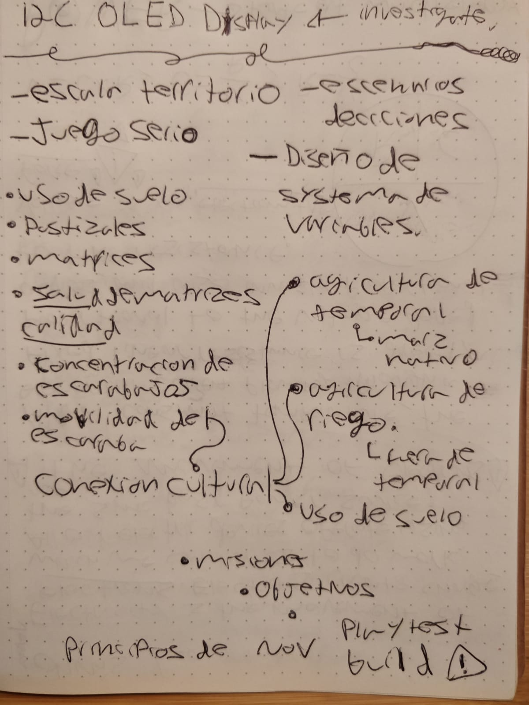
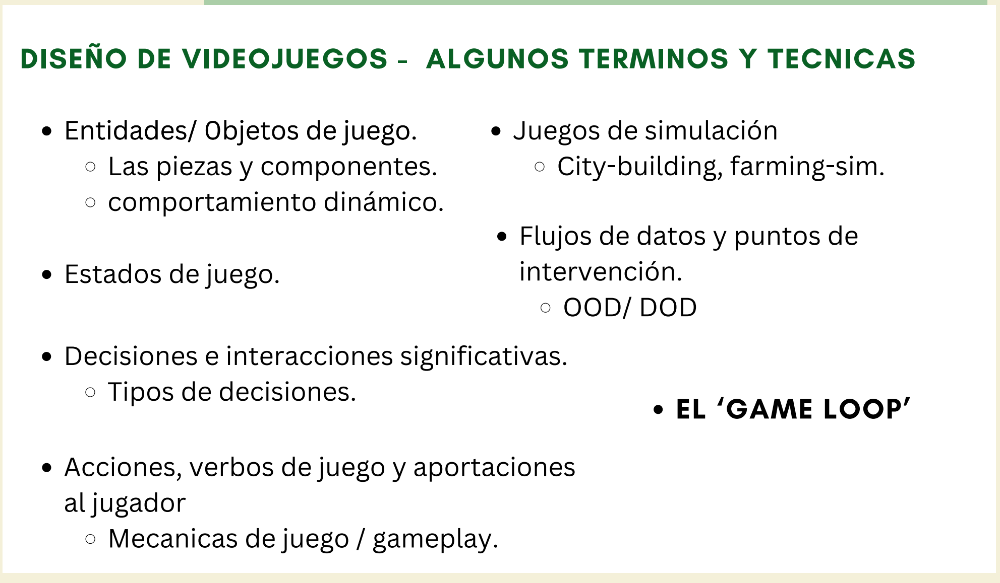
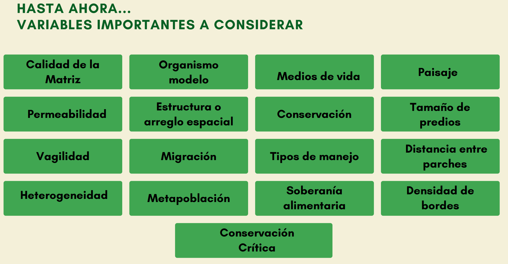
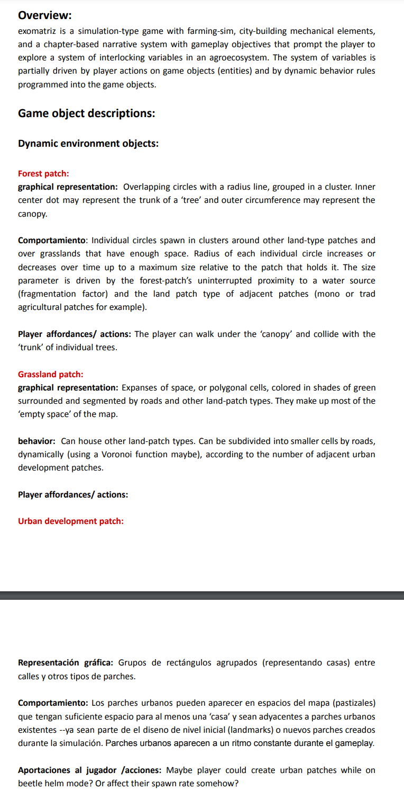
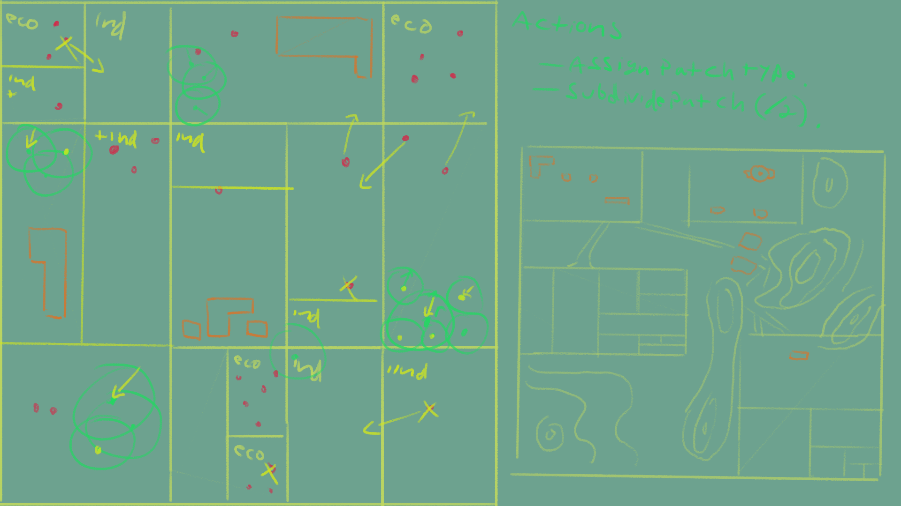
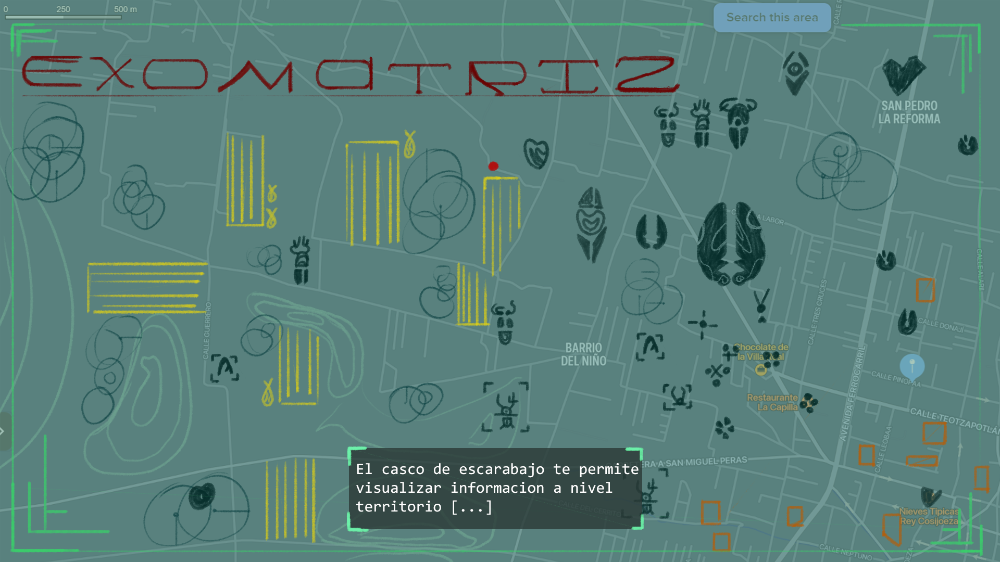

## 2 - take a step back even further:
Two district, but connected problems problems

Simulation: what are the inputs and outputs, and their relation to gameplay?

Visual representation: What does it look like and what are the systems to generate those visuals?

## 1 - Subsystem integration

The base layout and structure is mostly in place, we still need chapter transitions and the whole narrative design/ writing aspect. But at least we have a proof of concept level that we can build on or completely overhaul. It does give me an estimate of what is possible and what is needed going forward. The diagram above is what we are aiming for, we are trying to communicate THAT idea and lock in place all its components. 
I think that the part we need to focus on right now is the red 'patch' branch of the mind map. Implementing the four main patch types and a player action to create agricultural patches (or 'farmlands'). And, maybe, in parallel come up with a consolidated storyline of sorts or a narrative concept. My goals for this next stretch of production are the following:

- Integrate static patch types Forest and Urban, within the voronoi terrain generation. This will likely be a rather involved process since it implies taking the voronoi algo out of the shader graph and extending it's functionality trough a custom made system. The aim is to have forest and urban clusters spawn within the boundaries of voronoi cells, leaving enough space for agricultural patches to be placed in the level by the player.
- Extend the parcel manager system to implement two distinct types of farmland, eco an industrial. The main difference between the two being that eco-patches would have a magnetic force field component that attracts beetle particles to it. Both would be subdividable (not infinitely) and parcel subdivision would signify crop type --perhaps industrial patches would be able to support less types of crops and have a smaller limit for subdivision, but a greater yield of the available crops. 
- Implement player actions for placing eco and industrial 'farmlands' within voronoi cells, via mouse-click. The user experience would include a preview overlay of the farmland being placed. We have to think about sizing; would they adapt to fit the cell they are being placed in, or would they be a set size? would the eco be smaller that the industrial? or would the user be able to re-size them while placing them?
- Integrate beetle particle behavior (spawn radius, spawn rate & lifetime, possibly acceleration) into the farmland placement/ management system. The particle source point, the spawn radius could be dynamically determined by the concentration of eco patches in close proximity. Their spawn rate and lifetime, perhaps acceleration too, determined by the amount of industrial patches. What I am picturing here is something like if the distance between two eco patches is smaller that a value then create a particle spawn point equal to that vale in diameter. If there is no such value, then no particle emitter would be created, therefore the player would need to place at least two eco patches (farmlands in code), to create beetles.
	- Acceleration of beetle particles is an interesting parameter now that I think about it, it's a good one to communicate vagility, and beetles don't move very fast in reality. Their base speed could be pretty slow and an increase in industrial farmland would make them move faster, more likely to scape the influence of the magnetic force fields, travel further from their spawn point and make for a more hectic looking simulation.
-  
---
## UNAM Workshop | Partial transcript & discussion audio:

### [exomatriz - workshop discussion (audio)](https://youtu.be/6Xwg32BaKnc)

NOTE: The source audio file for the following transcript is currently trapped in my handy recorder's microSD card.

>"Este entonces, pues si, si quieren vamos a empezar.

>Ah yo?  yo me llamo Luis, este, yo pues estudie, bueno estoy aquí en la UNAM. Trabajo, bueno con Mariana llevo trabajando ya desde la licenciatura, en cosas de modelos de, bueno primero en un modelo sobre una reserva en Yucatan, era un modelo basado en agentes. Y luego otro tema que no tiene mucho que ver, bueno, tanto con la matriz, pero también ayude mucho a Lore en su proyecto, en el que se se esta basando creo este proyecto, y que mas?

>Y ya pues nada mas muchas gracias

>Hola yo soy Emilio y trabajo [...]"

### These materials are a good basis for reflection (for now I'll just drop them here):

---

---

---

---

---

---

---

---

---

---

---

---

---

---

---

---

---

---

---

---

---

---

---

---

---

---

---

